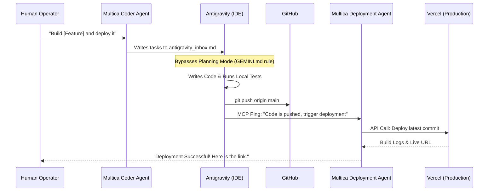

# Multi-Agent DevOps Pipeline Architecture

This document outlines the fully automated, multi-agent architecture used to develop, test, and deploy the NeoBank application. By utilizing specialized AI agents, we achieve a complete, hands-off CI/CD pipeline.

## The Agents

The ecosystem consists of three specialized agents working in tandem:

### 1. Multica Coder Agent (The Product Manager & Coordinator)
- **Role**: High-level task scoping and delegation.
- **Environment**: Multica Cloud/Dashboard.
- **Responsibility**: Takes human requirements (e.g., "Build a Contact Us page"), breaks them down into actionable technical tasks, and writes them to `antigravity_inbox.md` to trigger the engineering agent.

### 2. Antigravity (The Lead Software Engineer)
- **Role**: Code generation, testing, and Git operations.
- **Environment**: Local IDE (Trae/VSCode).
- **Responsibility**: 
  - Reads the `antigravity_inbox.md` instructions.
  - Autonomously bypasses "Planning Mode" (via the `GEMINI.md` rule) to write code, update schemas, and build UI components without requiring human intervention.
  - Commits and pushes the completed feature to the `main` branch on GitHub.
  - Writes a summary to `antigravity_outbox.md` and uses the `notify_multica` MCP tool to hand off the deployment phase.

### 3. Multica Deployment Agent (The DevOps Engineer)
- **Role**: Cloud infrastructure and Vercel deployments.
- **Environment**: Multica Cloud/Dashboard.
- **Responsibility**: 
  - Receives the hand-off ping from Antigravity.
  - Interfaces directly with the Vercel API.
  - Deploys the latest GitHub commit to production.
  - Returns the live deployment URL to the human operator.

---

## The Automated Workflow (End-to-End)

When a new feature is requested, the agents follow this strict, event-driven pipeline:

## Configuration & Rules

To maintain this seamless integration, the following configurations must remain in the repository:

1. **`GEMINI.md`**: Contains the critical behavioral rules instructing Antigravity to bypass manual user approvals when triggered by Multica.
2. **`antigravity_inbox.md` & `antigravity_outbox.md`**: The asynchronous communication bridge between the local IDE agent and the cloud Multica agents.
3. **`kali-multica-bridge` MCP Server**: The local tool that allows Antigravity to send HTTP pings to the Multica Deployment Agent to trigger the final Vercel build.
4. **Vercel GitHub Integration**: Vercel must remain linked to the GitHub repository to allow the Deployment Agent to deploy specific commits instantly.

---
*Generated by Antigravity - The AI Software Engineer*
